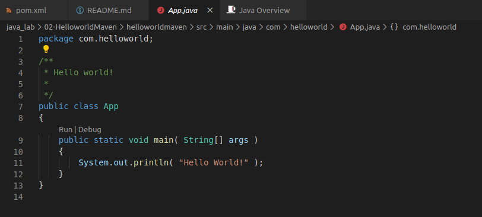

# Maven Helloworld

Project Helloworld in Maven & Java 11.

### 1. Creating the Maven Project

The project was created from Maven Projects, clicking on "+" icon and using the quickstart archetype.
Finally, changed the java version from 1.7 created by default to 11

### 2. Compilint the Project

Go to the pom.xml file and execute:

```shell
$ mvn compile

[INFO] Scanning for projects...
[INFO] 
[INFO] -------------------< com.helloworld:helloworldmaven >-------------------
[INFO] Building helloworldmaven 1.0-SNAPSHOT
[INFO] --------------------------------[ jar ]---------------------------------
[INFO] 
[INFO] --- maven-resources-plugin:3.0.2:resources (default-resources) @ helloworldmaven ---
[INFO] Using 'UTF-8' encoding to copy filtered resources.
[INFO] skip non existing resourceDirectory /home/diego/workdir/proyectos-GitHub/laboratories/java_lab/02-HelloworldMaven/helloworldmaven/src/main/resources
[INFO] 
[INFO] --- maven-compiler-plugin:3.8.0:compile (default-compile) @ helloworldmaven ---
[INFO] Nothing to compile - all classes are up to date
[INFO] ------------------------------------------------------------------------
[INFO] BUILD SUCCESS
[INFO] ------------------------------------------------------------------------
[INFO] Total time:  0.613 s
[INFO] Finished at: 2020-04-19T18:37:03+02:00
[INFO] ------------------------------------------------------------------------
```

### 2. Executing the project

Open the project in the workspace, the Java Overview will be open and in the App.java, will appear the commanda "Run" and "Debug". 



Click on the "Run" button

```shell
/usr/lib/jvm/java-11-openjdk-amd64/bin/java -Dfile.encoding=UTF-8 -cp /home/diego/workdir/proyectos-GitHub/laboratories/java_lab/02-HelloworldMaven/helloworldmaven/target/classes com.helloworld.App 
Hello World!
```
